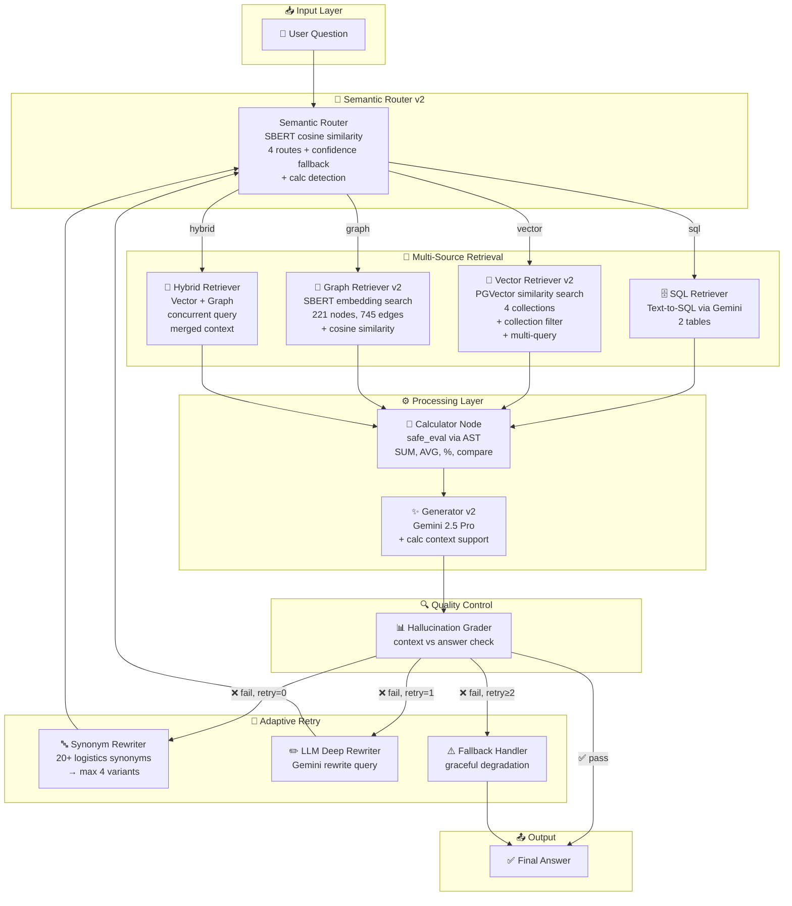
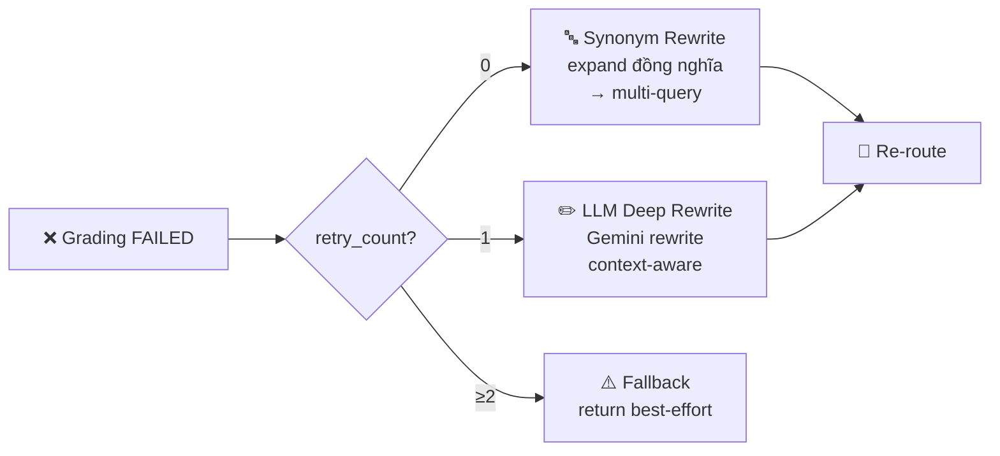
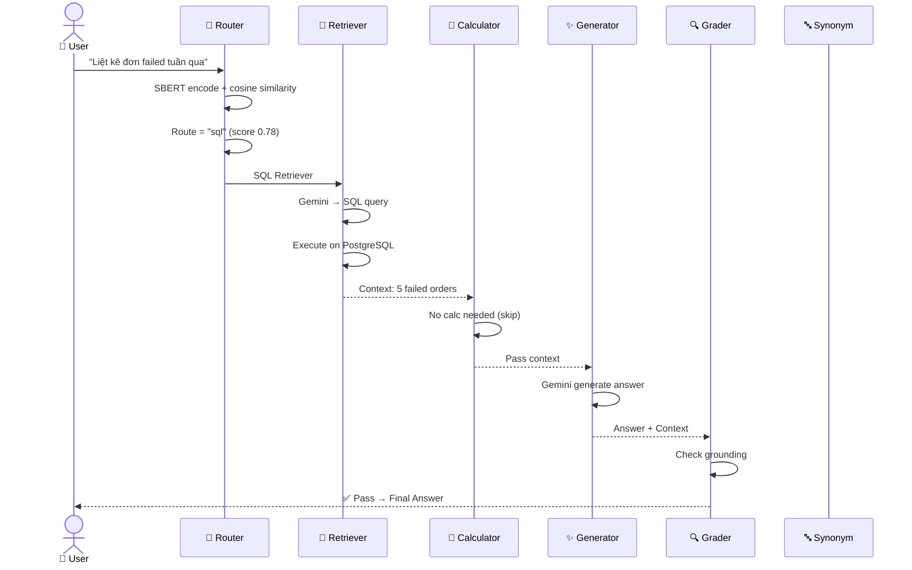
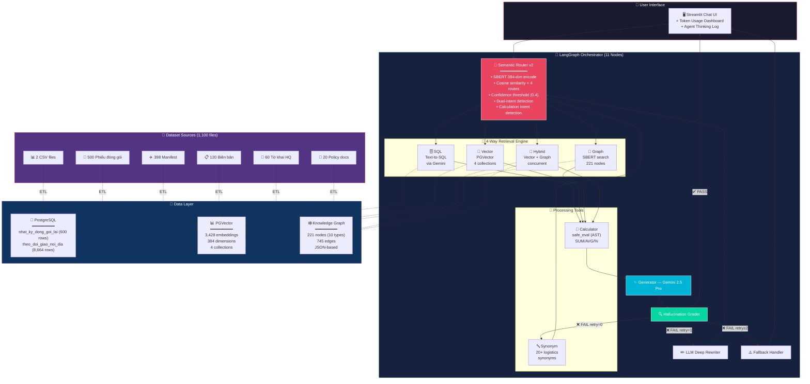
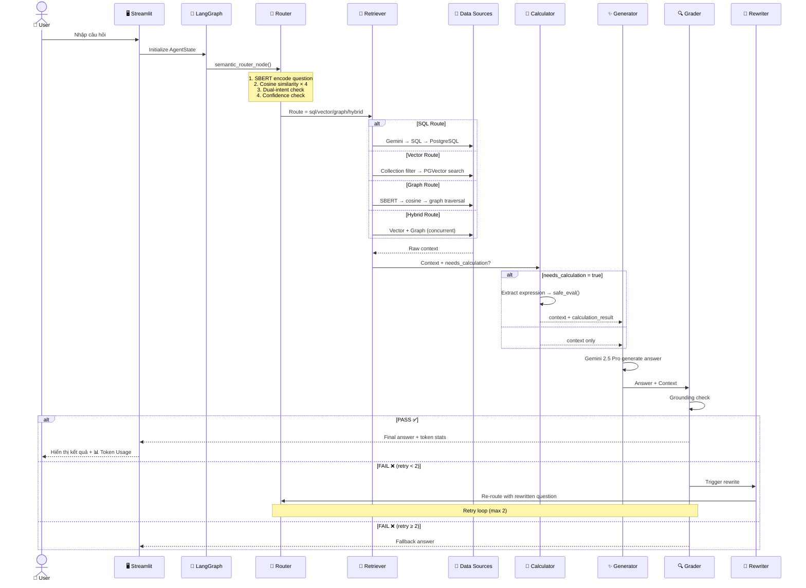
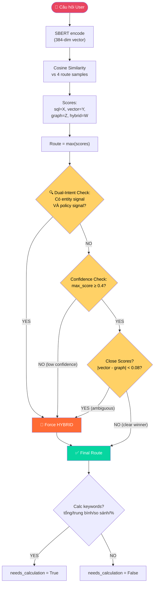

# 🚀 RAGNAROK — Multi-Agent RAG System v2
## Kiến Trúc Chi Tiết & Kịch Bản Test

---

## 1. TỔNG QUAN HỆ THỐNG

**RAGNAROK** (Retrieval-Augmented Generation with Networked Agent Knowledge Operating on Graphs) là hệ thống AI đa tác tử (Multi-Agent) xây dựng trên nền tảng **LangGraph**, tích hợp 3 nguồn dữ liệu:

| Nguồn dữ liệu | Mô tả | Số lượng |
|---|---|---|
| 🗄️ **SQL Database** | 2 bảng PostgreSQL: `nhat_ky_dong_goi_lai` (nhật ký đóng gói lại), `theo_doi_giao_noi_dia` (theo dõi giao nội địa) | ~9,000 records |
| 📄 **VectorDB** | 4 collections PGVector (384-dim embeddings): `phieu_dong_goi_vector` (2,074), `manifest_chuyen_bay_vector` (1,275), `to_khai_hai_quan` (273), `luat_vien_thong_kho` (162) | 3,784 embeddings |
| 🔗 **Knowledge Graph** | JSON graph với 221 nodes (TRACKING, SẢN_PHẨM, LOẠI_HƯ_HỎNG...) + 745 edges | 966 elements |

---

## 2. SƠ ĐỒ KIẾN TRÚC v2



---

## 3. CHI TIẾT TỪNG THÀNH PHẦN

### 3.1 Semantic Router v2 — Bộ định tuyến ngữ nghĩa

**Mục đích:** Phân loại câu hỏi → chọn nguồn dữ liệu phù hợp nhất.

**Cơ chế hoạt động:**
1. Encode câu hỏi bằng **SBERT** (sentence-transformers/all-MiniLM-L6-v2, 384 dim)
2. So sánh **cosine similarity** với 4 nhóm câu mẫu (samples):
   - `sql`: "Tổng phí đóng gói lại", "Số đơn giao thất bại"...
   - `vector`: "Quy định đóng gói hàng dễ vỡ", "Chính sách bảo hiểm"...
   - `graph`: "Tracking TRK0003227 chứa sản phẩm gì", "Mối quan hệ giữa..."
   - `hybrid`: "Kiện hàng bị hư hỏng theo quy định nào", "So sánh thực tế và chính sách"...

3. **Confidence-based fallback**:
   - Nếu `max_score < 0.4` → tự động chuyển sang `hybrid`
   - Nếu `|score_vector - score_graph| < 0.08` → dùng `hybrid`

4. **Calculation detection**: Phát hiện từ khóa tính toán (`tổng`, `trung bình`, `so sánh`, `%`) → bật cờ `needs_calculation`

```
┌──────────────────────────────────────────┐
│          SEMANTIC ROUTER v2              │
├──────────────────────────────────────────┤
│ Input: "Đơn hàng 2kg tại sao tính 3.5kg"│
│                                          │
│ Scores:                                  │
│   sql    = 0.52  ← highest              │
│   vector = 0.38                          │
│   graph  = 0.21                          │
│   hybrid = 0.41                          │
│                                          │
│ Decision: route = "sql"                  │
│ needs_calculation = True (keyword: "tại  │
│   sao", weight comparison detected)      │
└──────────────────────────────────────────┘
```

---

### 3.2 SQL Retriever — Truy vấn cấu trúc

**Mục đích:** Truy vấn dữ liệu số từ PostgreSQL.

| Table | Columns | Records |
|---|---|---|
| `nhat_ky_dong_goi_lai` | repack_id, tracking_code, order_code, customer_code, reason, original_weight_kg, new_weight_kg, repack_fee_vnd, material_cost_vnd, status... | ~350 |
| `theo_doi_giao_noi_dia` | delivery_id, tracking_code, order_code, customer_code, recipient_name, province, carrier, shipping_fee_vnd, cod_amount, delivery_status, attempt_count, scheduled_date, actual_delivery_date, delivery_note | ~8,664 |

**Cơ chế:** Gemini 2.5 Pro sinh SQL query từ NLP question → execute trên PostgreSQL → trả kết quả.

---

### 3.3 Vector Retriever v2 — Tìm kiếm ngữ nghĩa

**Mục đích:** Tìm tài liệu tương đương về ý nghĩa.

**4 Collections:**

| Collection | Nội dung | Embeddings |
|---|---|---|
| `phieu_dong_goi_vector` | 500 phiếu đóng gói + 120 biên bản | 2,074 |
| `manifest_chuyen_bay_vector` | 400 manifest chuyến bay | 1,275 |
| `to_khai_hai_quan` | 60 tờ khai hải quan | 273 |
| `luat_vien_thong_kho` | Chính sách phí, bảng giá, SOP kho, quy định đóng gói, điều khoản dịch vụ... | 162 |

**Tính năng mới v2:**
- **Collection Filtering**: Tự detect intent → chọn collection phù hợp
  - Keywords `luật`, `quy định`, `chính sách`, `bảng giá`, `hải quan` → filter `luat_vien_thong_kho` + `to_khai_hai_quan`
  - Keywords `phiếu đóng gói`, `biên bản`, `manifest` → filter `phieu_dong_goi_vector` + `manifest_chuyen_bay_vector`
- **Multi-Query**: Khi có synonym variants → query tất cả biến thể, merge + deduplicate kết quả

---

### 3.4 Graph Retriever v2 — Tìm quan hệ

**Mục đích:** Trả lời câu hỏi về mối quan hệ giữa các thực thể logistics.

**Cải tiến v2: Embedding-based Graph Search**
- ❌ v1: Substring match → bỏ sót nhiều entity
- ✅ v2: SBERT encode toàn bộ 221 node IDs → cosine similarity → top-10 matching

**Node Types:**

| Type | Ví dụ | Số lượng |
|---|---|---|
| TRACKING | TRK0003227, TRK0002796... | ~120 |
| SẢN_PHẨM | Đồng_hồ_thông_minh, Mỹ_phẩm... | ~60 |
| LOẠI_HƯ_HỎNG | Thùng_carton_bị_méo, Hàng_bị_vỡ... | 13 |
| TRẠNG_THÁI | Hàng_bị_hỏng, Hàng_vẫn_nguyên_vẹn | 2 |
| KHO | Kho_HN, Kho_HCM, Kho_ĐN... | ~10 |
| Others | BIÊN_BẢN_ID, CHUYẾN_BAY... | ~16 |

**Edge Types:** CHỨA_SẢN_PHẨM, BỊ_TÌNH_TRẠNG, CÓ_HƯ_HỎNG, GHI_NHẬN_TẠI, THUỘC_CHUYẾN...

---

### 3.5 Hybrid Retriever — Truy vấn kết hợp ⭐ MỚI

**Mục đích:** Khi câu hỏi cần thông tin từ cả tài liệu VÀ quan hệ thực thể.

**Cơ chế:**
```
User: "Kiện hàng TRK0003227 bị hư hỏng gì, và quy định đóng gói lại thế nào?"

├─ Vector Retriever → "Quy định đóng gói: Hàng dễ vỡ phải dùng foam..."
├─ Graph Retriever  → "TRK0003227 → CÓ_HƯ_HỎNG → Thùng_carton_bị_méo"
│
└─ Merged Context:
   ═══ THÔNG TIN TỪ TÀI LIỆU (VectorDB) ═══
   Quy định đóng gói: Hàng dễ vỡ phải dùng foam...
   ═══ THÔNG TIN TỪ KNOWLEDGE GRAPH ═══
   TRK0003227 → CÓ_HƯ_HỎNG → Thùng_carton_bị_méo
```

---

### 3.6 Calculator Node — Tính toán ⭐ MỚI

**Mục đích:** Thực hiện phép tính số học trên kết quả truy vấn.

**Cơ chế:**
1. LLM extract phép tính từ context + question
2. `safe_eval()` kiểm tra AST: chỉ cho phép `+`, `-`, `*`, `/`, `**`, `()`, numbers
3. Không cho phép `exec()`, `import`, `__`, function calls

**Ví dụ:**
```
Q: "Tổng phí đóng gói lại trong quý 4?"
Context: [150000, 200000, 180000, 250000]
→ Calculator: "150000 + 200000 + 180000 + 250000"
→ Result: 780000
```

---

### 3.7 Synonym Rewriter — Mở rộng từ đồng nghĩa ⭐ MỚI

**Mục đích:** Khi kết quả nghèo → tự động mở rộng câu hỏi bằng từ đồng nghĩa.

**Synonym Map (20+ entries):**

| Gốc | Đồng nghĩa |
|---|---|
| hư hỏng | thiệt hại, hỏng hóc, bể, vỡ |
| đóng gói | bao gói, packaging, đóng kiện |
| vận chuyển | giao hàng, ship, delivery, chuyển hàng |
| kiện hàng | bưu kiện, gói hàng, package |
| cước phí | phí vận chuyển, giá cước, shipping fee |
| trả về | hoàn hàng, return, trả lại |
| hải quan | customs, thông quan, khai báo |
| kho | warehouse, nhà kho, trung tâm phân phối |
| ... | ... |

**Retry Strategy:**



---

### 3.8 Generator v2 — Sinh câu trả lời

**Model:** Gemini 2.5 Pro (temperature=0.3)

**Prompt Template:**
- Nhận: context (từ retriever) + calculation_result (nếu có) + question
- Quy tắc: CHỈ trả lời dựa trên context, trích nguồn, trả lời bằng tiếng Việt
- Nếu không đủ dữ liệu → trả "KHÔNG_ĐỦ_DỮ_LIỆU"

### 3.9 Hallucination Grader — Kiểm tra ảo giác

**Model:** Gemini 2.5 Pro (temperature=0)

**Cơ chế:** So sánh answer vs context → trả "yes" (grounded) hoặc "no" (hallucinated)
- "yes" → trả kết quả cho user
- "no" → trigger retry strategy

---

## 4. LUỒNG XỬ LÝ END-TO-END



---

## 5. KỊCH BẢN TEST HOÀN CHỈNH

### 📋 Test Case 1: Chênh lệch cân nặng (SQL + Calculator + Vector)
> **"Đơn hàng của tôi nặng 2kg nhưng tại sao lại tính phí 3.5kg?"**

| Thuộc tính | Chi tiết |
|---|---|
| **Route dự kiến** | `sql` hoặc `hybrid` (có keyword cước phí + cân nặng) |
| **Nguồn dữ liệu** | `nhat_ky_dong_goi_lai` (SQL) + `luat_vien_thong_kho` (Vector) |
| **Cần test** | Router detect "tại sao tính phí" → có thể trigger hybrid |
| **Calculator** | Có thể cần tính khối lượng quy đổi |

**Expected Output (ý chính):**
> Theo chính sách tính phí, phí vận chuyển được tính dựa trên **khối lượng thực tế** hoặc **khối lượng quy đổi** (volumetric weight), lấy giá trị lớn hơn:
>
> - **Khối lượng quy đổi** = (Dài × Rộng × Cao) cm / 5000 (hoặc hệ số quy đổi tương đương)
> - Quy ước: Dưới 1kg → làm tròn thành 1kg. Trên 1kg → làm tròn 1 chữ số thập phân.
> - Hàng cồng kềnh: kích thước > 30×30×30 cm sẽ tính theo khối lượng quy đổi.
>
> **Kết luận:** Kiện hàng 2kg thực tế nhưng kích thước cồng kềnh → KL quy đổi = 3.5kg → tính phí theo 3.5kg.

**Dữ liệu liên quan trong DB:**
- `Bang_gia_van_chuyen_duong_air.md`: "Dưới 1kg → làm tròn thành 1kg", "Kích thước hàng cồng kềnh: (Dài x rộng x cao) > 30x30x30 cm"
- `Chinh_sach_phi_dich_vu_thanh_toan.md`: "Khối lượng thực tế" vs "khối lượng quy đổi theo tiêu chuẩn vận chuyển quốc tế"

---

### 📋 Test Case 2: Trạng thái kiện hàng (SQL)
> **"Kiện hàng của tôi hiện đang ở trạng thái nào?"**

| Thuộc tính | Chi tiết |
|---|---|
| **Route dự kiến** | `sql` (query DB trạng thái) |
| **Nguồn dữ liệu** | `theo_doi_giao_noi_dia` |
| **Cần test** | Router phải detect đây LÀ câu hỏi về trạng thái delivery |
| **Lưu ý** | Câu hỏi thiếu tracking code → agent có thể yêu cầu bổ sung |

**Expected Output (ý chính):**
> Anh/chị vui lòng cung cấp **mã tracking** (ví dụ: TRK0000003) để em tra cứu trạng thái cụ thể.
>
> Nếu có tracking code, hệ thống sẽ trả về:
> - Trạng thái: delivered / failed_attempt / returned
> - Ngày giao dự kiến / thực tế
> - Đơn vị vận chuyển (carrier)
> - Ghi chú giao hàng

**Dữ liệu mẫu (nếu cung cấp tracking TRK0000003):**
```
delivery_status: delivered
carrier: SPX Express
scheduled_date: 2023-12-06
actual_delivery_date: 2023-12-08
delivery_note: Giao thành công
recipient_name: Bùi Yến Bảo
province: Cần Thơ
```

---

### 📋 Test Case 3: Đơn hàng Failed (SQL + Calculator)
> **"Liệt kê các đơn hàng đang bị failed trong tuần qua."**

| Thuộc tính | Chi tiết |
|---|---|
| **Route dự kiến** | `sql` (query DB filter by status + date) |
| **Nguồn dữ liệu** | `theo_doi_giao_noi_dia` |
| **Cần test** | SQL gen phải tạo đúng WHERE clause |
| **Calculator** | Có thể tính tổng số đơn failed |

**Expected Output (ý chính):**
> Dưới đây là danh sách các đơn hàng bị **failed_attempt** trong tuần qua:
>
> | # | Delivery ID | Tracking | Recipient | Province | Carrier | Scheduled | Note |
> |---|---|---|---|---|---|---|---|
> | 1 | DEL0008554 | TRK0011883 | Hoàng Phương Thị Mai | Đà Nẵng | GHN | 2025-11-13 | (trống) |
> | 2 | DEL0003067 | TRK0004205 | Trần Mai Thị Thanh | Hải Phòng | GHN | 2025-11-10 | Không có người nhận |
> | ... | ... | ... | ... | ... | ... | ... | ... |
>
> **Tổng:** X đơn failed trong tuần qua.

**Dữ liệu thực từ DB:**
- Tổng đơn `failed_attempt`: **1,706 đơn** (toàn bộ)
- Date range: 2023-01 đến 2025-11
- Sample carriers: GHN, Ninja Van, SPX Express, Best Express
- Delivery statuses: `delivered` (5,206), `returned` (1,752), `failed_attempt` (1,706)

---

### 📋 Test Case 4: Hybrid Query — Cross-source
> **"Tracking TRK0003227 chứa sản phẩm gì, và quy định đóng gói hàng dễ vỡ là gì?"**

| Thuộc tính | Chi tiết |
|---|---|
| **Route dự kiến** | `hybrid` (cần cả Graph + Vector) |
| **Nguồn dữ liệu** | Knowledge Graph (Graph) + `luat_vien_thong_kho` (Vector) |
| **Cần test** | Hybrid retriever chạy đồng thời, merge context |

**Expected Output (ý chính):**
> **Thông tin từ Knowledge Graph:**
> - TRK0003227 → CHỨA_SẢN_PHẨM → [tên sản phẩm cụ thể]
> - TRK0003227 → BỊ_TÌNH_TRẠNG → [trạng thái nếu có]
>
> **Quy định đóng gói hàng dễ vỡ (từ chính sách):**
> - Phải sử dụng foam/bubble wrap bao quanh
> - Dán nhãn "Hàng dễ vỡ / Fragile"
> - [Chi tiết từ Quy_dinh_quy_cach_dong_goi.md]

---

### 📋 Test Case 5: Synonym Rewrite
> **"Kiện hàng bị thiệt hại tại kho Hà Nội"**

| Thuộc tính | Chi tiết |
|---|---|
| **Route dự kiến** | `graph` hoặc `hybrid` |
| **Cần test** | "thiệt hại" → synonym rewrite → "hư hỏng", "hỏng hóc", "bể", "vỡ" |
| **Nguồn dữ liệu** | Knowledge Graph (loại hư hỏng) |

**Expected Output (ý chính):**
> Tại kho Hà Nội, các kiện hàng bị hư hỏng ghi nhận:
> - Thùng carton bị méo
> - Mép hộp bị bẹp
> - Bao bì bị ẩm ướt
> - [danh sách từ graph nodes LOẠI_HƯ_HỎNG]

**Synonym Expansion Log:**
```
Original: "kiện hàng bị thiệt hại tại kho Hà Nội"
Variants:
  1. "kiện hàng bị hư hỏng tại kho Hà Nội"
  2. "bưu kiện bị thiệt hại tại warehouse Hà Nội"
  3. "gói hàng bị hỏng hóc tại nhà kho Hà Nội"
```

---

### 📋 Test Case 6: Collection Filter
> **"Luật hải quan về khai báo hàng hóa xuất nhập khẩu"**

| Thuộc tính | Chi tiết |
|---|---|
| **Route dự kiến** | `vector` |
| **Collection Filter** | Detect "hải quan", "khai báo" → filter: `to_khai_hai_quan` + `luat_vien_thong_kho` |
| **Cần test** | Chỉ search 2 collections thay vì all 4 |

**Expected Output (ý chính):**
> Theo tờ khai hải quan và chính sách của công ty:
> - Khai báo trung thực, đầy đủ số lượng và chủng loại hàng hóa
> - Thuế/phí theo quy định cơ quan hải quan
> - [Chi tiết từ to_khai_hq_*.md documents]

---

### 📋 Test Case 7: Calculator
> **"Tổng phí đóng gói lại cho các đơn hàng trong tháng vừa qua?"**

| Thuộc tính | Chi tiết |
|---|---|
| **Route dự kiến** | `sql` |
| **Calculator** | `needs_calculation = True` (keyword: "tổng phí") |
| **SQL Query expected** | `SELECT SUM(repack_fee_vnd) FROM nhat_ky_dong_goi_lai WHERE ...` |

**Expected Output (ý chính):**
> Tổng phí đóng gói lại trong tháng vừa qua: **X,XXX,XXX VNĐ**
> - Gồm Y đơn hàng được đóng gói lại
> - Chi phí vật liệu: Z,ZZZ,ZZZ VNĐ

---

### 📋 Test Case 8: Manifest Flight Info (Vector)
> **"Manifest chuyến bay FL0001_TG202 chứa những kiện hàng nào?"**

| Thuộc tính | Chi tiết |
|---|---|
| **Route dự kiến** | `vector` |
| **Collection Filter** | Detect "manifest", "chuyến bay" → filter: `manifest_chuyen_bay_vector` |
| **Cần test** | Truy xuất đúng manifest document |

---

### 📋 Test Case 9: Biên bản kiểm tra (Hybrid)
> **"Biên bản kiểm tra TRK0003227 ghi nhận hư hỏng gì và đã xử lý thế nào?"**

| Thuộc tính | Chi tiết |
|---|---|
| **Route dự kiến** | `hybrid` (cần cả Vector biên bản + Graph mối quan hệ) |
| **Nguồn** | `phieu_dong_goi_vector` (biên bản) + Knowledge Graph (tracking → hư hỏng) |

---

### 📋 Test Case 10: Edge Case — Question không có dữ liệu
> **"Thời tiết hôm nay ở Hà Nội thế nào?"**

| Thuộc tính | Chi tiết |
|---|---|
| **Route dự kiến** | Bất kỳ (confidence thấp → hybrid fallback) |
| **Expected** | "KHÔNG_ĐỦ_DỮ_LIỆU" hoặc fallback message |

---

## 6. CÁCH TEST

### 6.1 Chạy System

```bash
cd /home/namdang-fdp/Projects/RAGNAROK/ai-service
source venv/bin/activate
streamlit run app.py
```

### 6.2 Test Checklist

| # | Test Case | Input | Kiểm tra | Pass/Fail |
|---|---|---|---|---|
| 1 | Weight discrepancy | "Đơn hàng của tôi nặng 2kg nhưng tại sao lại tính phí 3.5kg?" | Route + Giải thích volumetric weight | ☐ |
| 2 | Tracking status | "Kiện hàng của tôi hiện đang ở trạng thái nào?" | Route SQL + Yêu cầu tracking code | ☐ |
| 3 | Failed orders | "Liệt kê các đơn hàng đang bị failed trong tuần qua." | Route SQL + Liệt kê đúng | ☐ |
| 4 | Hybrid query | "TRK0003227 chứa sản phẩm gì, quy định đóng gói dễ vỡ?" | Route hybrid + Merge context | ☐ |
| 5 | Synonym rewrite | "Kiện hàng bị thiệt hại tại kho Hà Nội" | Synonym expand + tìm được | ☐ |
| 6 | Collection filter | "Luật hải quan về khai báo hàng hóa" | Filter đúng collection | ☐ |
| 7 | Calculator | "Tổng phí đóng gói lại tháng vừa qua?" | SUM calculation | ☐ |
| 8 | Manifest lookup | "Manifest FL0001_TG202 chứa kiện nào?" | Filter manifest collection | ☐ |
| 9 | Biên bản hybrid | "Biên bản TRK0003227 hư hỏng gì?" | Hybrid context merge | ☐ |
| 10 | Edge case | "Thời tiết Hà Nội?" | KHÔNG_ĐỦ_DỮ_LIỆU | ☐ |

### 6.3 Xem Agent Thinking Log

Trong Streamlit UI, mở expander **"🧠 Agent Thinking Log"** để xem:
- Route được chọn và confidence scores
- SQL query đã sinh
- Synonym expansion (nếu có)
- Calculator result (nếu có)
- Grading result
- Retry attempts

---

## 7. TECH STACK

| Component | Technology |
|---|---|
| **Orchestration** | LangGraph (StateGraph) |
| **LLM** | Google Gemini 2.5 Pro |
| **Embedding** | sentence-transformers/all-MiniLM-L6-v2 (384-dim) |
| **Database** | PostgreSQL + PGVector extension |
| **Frontend** | Streamlit |
| **Language** | Python 3.12 |
| **Key Libraries** | langchain-google-genai, sqlalchemy, psycopg2, sentence-transformers |

---

## 8. 🏗️ SYSTEM ARCHITECTURE DIAGRAM

### 8.1 High-Level Data Flow



### 8.2 Component Interaction — Sequence Flow



---

## 9. 🧭 ROUTING LOGIC — Khi nào dùng SQL / Vector / Graph / Hybrid?

### 9.1 Decision Flowchart



### 9.2 Chi tiết Routing Logic

#### 🗄️ SQL Route — Truy vấn dữ liệu có cấu trúc

| Tiêu chí | Chi tiết |
|---|---|
| **Khi nào dùng** | Câu hỏi về **số liệu, thống kê, danh sách** từ database |
| **Từ khóa trigger** | "tổng phí", "liệt kê đơn", "trạng thái giao hàng", "số đơn failed", "tracking code", "phí đóng gói" |
| **Cosine samples** | "Tổng phí đóng gói lại", "Liệt kê đơn giao thất bại", "Trạng thái kiện hàng TRKxxx" |
| **Data source** | `nhat_ky_dong_goi_lai` (600 rows) + `theo_doi_giao_noi_dia` (8,664 rows) |
| **Ví dụ** | "Tổng phí đóng gói lại tháng 10?" → SQL: `SELECT SUM(repack_fee_vnd) FROM ...` |

#### 📄 Vector Route — Tìm kiếm ngữ nghĩa trong tài liệu

| Tiêu chí | Chi tiết |
|---|---|
| **Khi nào dùng** | Câu hỏi về **chính sách, quy định, luật, quy trình** |
| **Từ khóa trigger** | "quy định", "chính sách", "luật hải quan", "bảng giá", "SOP", "điều khoản", "manifest" |
| **Collection filtering** | Auto-detect keywords → chỉ search collections liên quan |
| **Data source** | 4 PGVector collections (3,428 embeddings tổng) |
| **Ví dụ** | "Quy định đóng gói hàng dễ vỡ?" → Search `luat_vien_thong_kho` |

#### 🔗 Graph Route — Truy vấn quan hệ thực thể

| Tiêu chí | Chi tiết |
|---|---|
| **Khi nào dùng** | Câu hỏi về **mối quan hệ giữa tracking, sản phẩm, hư hỏng** |
| **Từ khóa trigger** | "TRKxxxx chứa gì", "mối quan hệ", "liên kết", "sản phẩm nào", "bị hư hỏng loại gì" |
| **Cơ chế search** | SBERT encode all 221 node IDs → cosine similarity → traverse edges |
| **Data source** | Knowledge Graph (221 nodes, 745 edges, 10 node types) |
| **Ví dụ** | "TRK0003227 chứa sản phẩm gì?" → Graph traversal → CHỨA_SẢN_PHẨM edges |

#### 🔀 Hybrid Route — Kết hợp Vector + Graph

| Tiêu chí | Chi tiết |
|---|---|
| **Khi nào dùng** | Câu hỏi cần **CẢ thông tin thực thể VÀ tài liệu chính sách** |
| **Trigger tự động** | 3 cách trigger: |
| | ① **Dual-Intent**: entity (TRK/ORD/kiện hàng) + policy (quy định/đóng gói/bảo hiểm) |
| | ② **Low confidence**: `max_score < 0.4` |
| | ③ **Ambiguous**: `|score_vector - score_graph| < 0.08` |
| **Cơ chế** | Chạy Vector + Graph **đồng thời** → merge context |
| **Ví dụ** | "TRK0003227 bị hư gì, quy định đóng gói lại thế nào?" |

### 9.3 Dual-Intent Detection — Chi tiết

```python
# Entity Signals (tham chiếu đến thực thể cụ thể)
entity_signals = [
    r'TRK\d+',           # Tracking codes: TRK0003227
    r'ORD\d+',           # Order codes: ORD0001234
    "kiện hàng",         # Package references
    "lô hàng",           # Batch references
    "sản phẩm",          # Product references
    "bị hư", "bị hỏng",  # Damage references
    "bị bẹp", "bị vỡ",  # Specific damage types
]

# Policy Signals (tham chiếu đến quy định/chính sách)
policy_signals = [
    "quy định", "chính sách",  # Regulations
    "hướng dẫn", "quy trình",  # Guidelines
    "luật", "thủ tục",        # Laws/procedures
    "bảng giá", "điều khoản",  # Pricing/terms
    "đóng gói", "bảo hiểm",   # Packaging/insurance
    "bồi thường", "khiếu nại", # Claims
    "xử lý", "phí", "cước",   # Processing/fees
]

# Logic: entity + policy → HYBRID
if has_entity_signal AND has_policy_signal:
    route = "hybrid"  # Force hybrid for comprehensive answers
```

### 9.4 Routing Examples

| # | Câu hỏi | Entity? | Policy? | Confidence | Route | Lý do |
|---|---|---|---|---|---|---|
| 1 | "Tổng phí đóng gói lại tháng 10?" | ❌ | ❌ | sql=0.78 | **SQL** | Truy vấn số liệu |
| 2 | "Quy định đóng gói hàng dễ vỡ?" | ❌ | ✅ đóng gói | vector=0.72 | **Vector** | Tìm policy doc |
| 3 | "TRK0003227 chứa sản phẩm gì?" | ✅ TRK | ❌ | graph=0.81 | **Graph** | Truy vấn quan hệ |
| 4 | "TRK0003227 bị hư gì + quy định đóng gói?" | ✅ TRK | ✅ đóng gói | — | **Hybrid** | Dual-intent! |
| 5 | "Kiện hàng bị hỏng theo chính sách nào?" | ✅ kiện hàng | ✅ chính sách | — | **Hybrid** | Dual-intent! |
| 6 | "Hôm nay thời tiết thế nào?" | ❌ | ❌ | max=0.15 | **Hybrid** | Low confidence fallback |
| 7 | "Tracking giao hàng tốn bao nhiêu cước?" | ✅ tracking | ✅ cước | — | **Hybrid** | Dual-intent! |

---

## 10. 🌟 ƯU ĐIỂM NỔI BẬT CỦA DỰ ÁN

### 🏗️ Kiến Trúc & Thiết Kế

| # | Ưu điểm | Chi tiết |
|---|---|---|
| 1 | **Multi-Agent Architecture** | 11 nodes tự trị trong LangGraph pipeline, mỗi node chuyên biệt một nhiệm vụ (Single Responsibility) |
| 2 | **4-Way Intelligent Routing** | Router tự động phân luồng SQL/Vector/Graph/Hybrid dựa trên ngữ nghĩa, không cần rule cứng |
| 3 | **Dual-Intent Detection** | Tự phát hiện câu hỏi cần cả entity data + policy docs → force hybrid route |
| 4 | **Hybrid Retrieval (Vector + Graph)** | Kết hợp semantic search VÀ graph traversal đồng thời, merge context thông minh |
| 5 | **Self-Healing Retry** | 3-tier retry: Synonym Rewrite → LLM Deep Rewrite → Graceful Fallback |
| 6 | **Modular Pipeline** | Dễ thêm/bớt node, mỗi node là function độc lập, state-driven |

### 🤖 AI & NLP

| # | Ưu điểm | Chi tiết |
|---|---|---|
| 7 | **SBERT Semantic Understanding** | Embedding 384-dim cho cả routing LẪN graph search, không dùng keyword matching thô |
| 8 | **Confidence-Based Fallback** | Nếu router không tự tin (score < 0.4) → tự động fallback hybrid, tránh trả lời sai |
| 9 | **Hallucination Guard** | Mọi câu trả lời đều được Grader kiểm tra grounding vs context trước khi trả user |
| 10 | **Domain-Specific Synonyms** | 20+ logistics/hải quan synonym pairs, tự động expand query khi kết quả nghèo |
| 11 | **Text-to-SQL via LLM** | Gemini tự sinh SQL query từ natural language, hỗ trợ multi-table JOIN |
| 12 | **Token Usage Tracking** | Theo dõi input/output tokens từng LLM call, xuất chi tiết per-node |

### 📊 Data & Scale

| # | Ưu điểm | Chi tiết |
|---|---|---|
| 13 | **Multi-Source Integration** | 3 loại data source (SQL + VectorDB + Knowledge Graph) trong 1 pipeline |
| 14 | **Large-Scale Dataset** | 1,100 files, 9,264 SQL records, 3,428 embeddings, 221 graph nodes |
| 15 | **Smart Collection Filtering** | Tự detect keywords → chỉ search collections liên quan (giảm noise, tăng precision) |
| 16 | **Multi-Query Search** | Synonym variants → query song song tất cả biến thể, merge + deduplicate |

### 🎯 User Experience

| # | Ưu điểm | Chi tiết |
|---|---|---|
| 17 | **Real-Time Agent Thinking Log** | User thấy từng bước suy nghĩ của AI: routing → retrieval → generation → grading |
| 18 | **Token Usage Dashboard** | 4 metric cards (Input/Output/Total/Calls) + expandable per-node breakdown |
| 19 | **Vietnamese-First** | Toàn bộ prompts, synonyms, responses tối ưu cho tiếng Việt chuyên ngành logistics |
| 20 | **Natural Language Interface** | Hỏi bằng tiếng Việt tự nhiên, không cần biết SQL hay API |

### 🔒 An Toàn & Bảo Mật

| # | Ưu điểm | Chi tiết |
|---|---|---|
| 21 | **Safe Math Eval** | Calculator dùng AST parse, chỉ cho phép operators toán học, block `exec/import/__` |
| 22 | **SQL Injection Prevention** | Chỉ cho phép SELECT queries, block INSERT/UPDATE/DELETE, LIMIT 20 |
| 23 | **Graceful Degradation** | Khi hết retry → trả fallback thân thiện thay vì crash |
| 24 | **No Hallucination Tolerance** | Câu trả lời bịa đặt sẽ bị reject và retry tự động |

### 🚀 Scalability & Extensibility

| # | Ưu điểm | Chi tiết |
|---|---|---|
| 25 | **Plug-and-Play Nodes** | Thêm collection mới chỉ cần update `VECTOR_COLLECTIONS` list |
| 26 | **Easy Route Extension** | Thêm route mới (e.g., `api`) chỉ cần thêm samples + retriever node |
| 27 | **Configurable Thresholds** | Confidence threshold, retry limit, similarity cutoff đều configurable |
| 28 | **Graph Expandable** | Knowledge Graph có thể grow từ 221 → 10,000+ nodes không cần đổi code |

